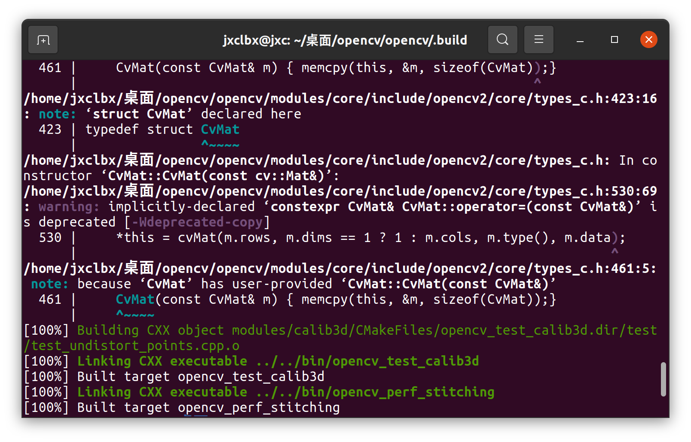
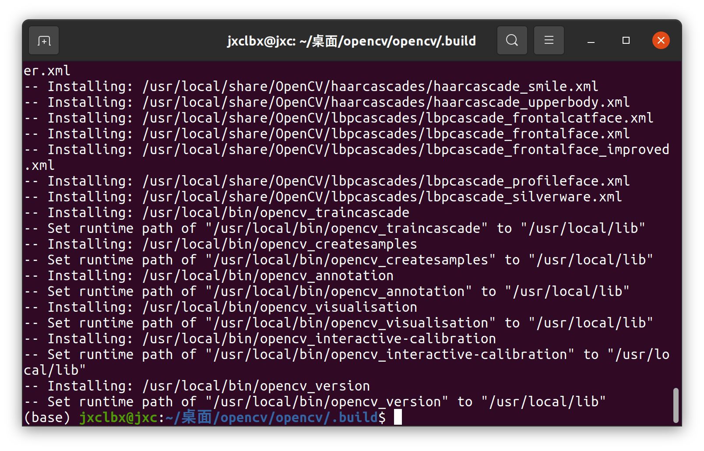
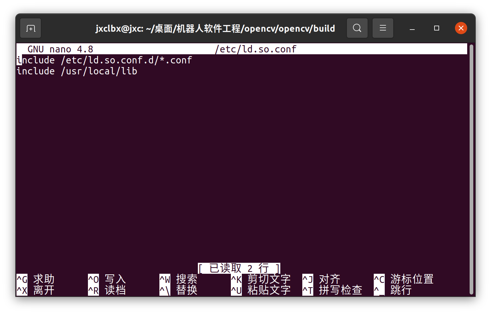
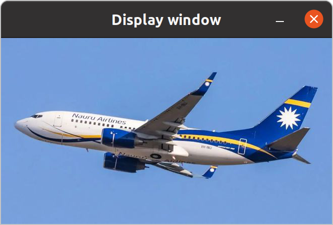

## 第一次作业

### 下载编译OpenCV 3.4.1 源码（或其他更新版本）

如下是我尝试下载的过程

```bash
# 进入桌面目录
cd 桌面

# 创建一个名为 opencv 的新目录
mkdir opencv

# 进入新创建的 opencv 目录
cd opencv/

# 尝试克隆 OpenCV 的指定版本（3.4.1），但发现没有安装 git
git clone -b 3.4.1 https://github.com/opencv/opencv.git

# 根据提示安装 git
sudo apt install git

# 安装 git 之后，再次尝试克隆 OpenCV 的指定版本（3.4.1）
git clone -b 3.4.1 https://github.com/opencv/opencv.git
```

### 使用CMake和make进行编译链接以上程序

```bash
# 进入 OpenCV 源代码目录
cd opencv
# 创建一个新的构建目录
mkdir build
# 进入构建目录
cd build

# 使用 CMake 生成 Makefile，指定构建类型和安装路径
cmake -D CMAKE_BUILD_TYPE=Release -D CMAKE_INSTALL_PREFIX=/usr/local ..

# 编译 OpenCV，并利用所有可用核心加速编译过程
make -j$(nproc)

```



```bash
# 安装 OpenCV 到指定的安装路径
sudo make install
```



#### 编译与交叉编译

在软件开发中，编译是一个基本步骤，它涉及将高级语言写成的源代码转换成可以在计算机上直接运行的机器代码或字节码。根据编译环境和目标环境的不同，编译过程可以分为两种：**编译**和**交叉编译**。

**编译**通常指的是在目标平台上进行的编译过程。这意味着编译的结果（可执行文件或库文件）将在同一类型的系统或架构上运行。例如，在一个 x86 架构的 Ubuntu 系统上编译的程序，旨在同样的 x86 架构上运行。

```bash
# 示例：在 Ubuntu 系统上编译一个 C 程序
gcc -o myprogram myprogram.c
```

相反，交叉编译是指在一种架构或操作系统上编译代码，但生成的可执行文件是为在另一种架构或操作系统上运行而设计的。这在嵌入式系统开发中尤其常见，因为许多嵌入式设备的处理能力有限，不适宜直接在上面编译复杂的软件。

```
# 示例：在 x86 架构的 Ubuntu 系统上交叉编译 ARM 架构的程序
arm-linux-gnueabi-gcc -o myprogram_arm myprogram.c
```

### 编写显示图片的程序

```cpp
#include <opencv2/opencv.hpp>
#include <iostream>

int main(int argc, char** argv)
{
    if (argc != 2)
    {
        std::cout << "Usage: display_image <Image_Path>" << std::endl;
        return -1;
    }

    cv::Mat image = cv::imread(argv[1], cv::IMREAD_COLOR);

    if (image.empty())
    {
        std::cout << "Could not open or find the image" << std::endl;
        return -1;
    }

    cv::namedWindow("Display window", cv::WINDOW_AUTOSIZE);
    cv::imshow("Display window", image);

    cv::waitKey(0);
    return 0;
}

```

1. `int main(int argc, char** argv)`: 这是 C++ 程序的入口点。`argc` 表示命令行参数的数量，`argv` 是一个字符串数组，包含了所有的命令行参数。
2. `if (argc != 2) { ... }`: 这个条件检查程序是否接收到了正确数量的命令行参数。这个程序期望有一个参数：图片的路径。如果没有提供正确的参数，程序会显示使用方法并退出。
3. `cv::Mat image = cv::imread(argv[1], cv::IMREAD_COLOR);`: 这行代码使用 OpenCV 的 `imread` 函数加载指定路径的图片。`argv[1]` 是命令行提供的图片路径
4. `if (image.empty()) { ... }`: 检查图片是否成功加载。如果 `image.empty()` 返回 `true`，表示图片未能加载，程序将打印错误消息并退出
5. `cv::namedWindow("Display window", cv::WINDOW_AUTOSIZE);`: 创建一个窗口来显示图片
6. `cv::imshow("Display window", image);`: 在前面创建的窗口中显示图片

### 遇到的问题

#### 没有连接库

```bash
collect2: error: ld returned 1 exit status

生成已完成，但出现错误。

```

使用

```bash
g++ 1.cpp -o 1 `pkg-config --cflags --libs opencv`
```

运行时候又出现

```bash
./1: error while loading shared libraries: libopencv_highgui.so.3.4: cannot open shared object file: No such file or directory
```

则

```bash
sudo nano /etc/ld.so.conf
```



#### 缺少GUI

```bash
OpenCV(3.4.1) Error: Unspecified error (The function is not implemented. Rebuild the library with Windows, GTK+ 2.x or Carbon support. If you are on Ubuntu or Debian, install libgtk2.0-dev and pkg-config, then re-run cmake or configure script) in cvNamedWindow, file /home/jxclbx/桌面/opencv/opencv/modules/highgui/src/window.cpp, line 618
terminate called after throwing an instance of 'cv::Exception'
  what():  OpenCV(3.4.1) /home/jxclbx/桌面/opencv/opencv/modules/highgui/src/window.cpp:618: error: (-2) The function is not implemented. Rebuild the library with Windows, GTK+ 2.x or Carbon support. If you are on Ubuntu or Debian, install libgtk2.0-dev and pkg-config, then re-run cmake or configure script in function cvNamedWindow
```

```bash
sudo apt-get update
sudo apt-get install libgtk2.0-dev pkg-config
```

解决后重新编译

### 结果


